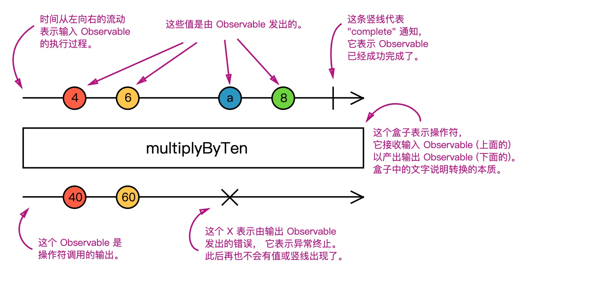

# RxJS Note

## 什么是RxJS?

RxJS全称 Reactive Extensions for JavaScript, RxJS是一个库,它通过使用 observable 序列来编写异步和基于事件的程序。

RxJS是结合了函数式编程、观察者模式、迭代器模式的产物

1. 函数式编程, 可以参考阮一峰[函数式编程初探]([函数式编程初探 - 阮一峰的网络日志](http://www.ruanyifeng.com/blog/2012/04/functional_programming.html))
2. 观察者模式, 典型的有DOM EventListener
3. 迭代器模式, 典型的有ES6 Iterater

## RxJS内容

##### 2-1基本概念

- Observable(被观察者)
  
- Observer(观察者)
  
- Operators(操作符)
  
- Subscribtion(订阅)
  
- Subject(主题)
  
- Scheduler(调度器)
  
  另: 弹珠图
  

##### 2-2:概念解析

**Observable核心关注点:**

- 创建Observable : Observable.create等创建类操作符
- 订阅Observable: observable.subscribe(observer)
- 执行Observable: observer.next()、observer.error()、observer.complete()
- 取消Observable: subscribtion.unsubscribe()

创建Observable的方法示例:

```javascript
//公式表示Observable
Observable = Publisher + Iterator
```

```javascript
// 01
var observable = Rx.Observable.create(function subscribe(observer) {
  var id = setInterval(() => {
    observer.next("hi")
  }, 1000);
});
// 02
var observable = Rx.Observable.of(...)
// 03 
var observable = Rx.Observable.from(...)
// 04
var observable = Rx.Observable.interval(1000)
// etc....
```

Observable注意事项:

1. 延迟计算: 不订阅就不会执行
  
  一个observable对象不订阅的话就不会执行
  
2. 渐进式取值: 示例代码
  
  ```javascript
  var source = Rx.Observable.from([1,2,3]);
  var example = souce
              .filter(x => x % 2 === 0)
              .map(x => x + 1)
  
  example.subscribe(console.log);
  // 执行过程
  // step1: 1 ==> filter ==> map
  // step2: 2 ==> filter ==> map
  // step3: 3 ==> filter ==> map
  // 一个元素会执行到底
  ```
  

**Observer:**

Observer即Observable产生数据后的消费者就是Observer,Observer是一组函数调用的集合,每个回调函数对应一种 Observable 发送的通知类型：`next`、`error` 和 `complete`

典型的observer对象:

```javascript
const observer = {
  next: x => console.log("Observer got a next value: " + x),
  error: err => console.error("Observer got an error: " + err),
  complete: () => console.log("Observer got a complete notification"),
};
//另外一种形式
observable.subscribe(console.log)
// 👆的代码当subscribe方法不传入, error, complete 的时候, 会把第一个参数默认为next方法
```

使用观察者的时候必须把observer提供给Observable的subscrib方法

Observable又分为两种:

- Cold Observable =>类似电视台播放节目, cold observable可以理解成每次subscribe后都产生一个“生产者”, 然后这个生产者产生的数据通过next函数传递给订阅的Observer.
  
  ```javascript
  const cold$ = new Observable(observer = > {
      const producer = new Producer()
      // observer 接受producer产生的数据并处理
  })
  ```
  
- Hot Observable => 类似视频点播网站, youku,bilibili etc... hot observable概念上是有一个独立于Observable对象的“生产者”，这个“生产者”的创建和subscribe调用没有关系，subscribe调用只是让Observer连接上“生产者”而已
  
  ```javascript
  const producer = new Producer()
  const hot$ = new Observable(observer => {
      // obsever 接受并处理producer
  })
  ```
  

## **Subscription**

Subscription表示的是一个可清理的资源对象, 即Observable订阅执行后的结果, Subscription~~基本上只有一个~~unsubscribe方法

```javascript
var subscription = observable.subscribe(observer)

//基本上只有一个unsubscribe方法
var observable1 = Rx.Observable.interval(400);
var observable2 = Rx.Observable.interval(300);

var subscription = observable1.subscribe(x => console.log("first: " + x));
var childSubscription = observable2.subscribe(x => console.log("second: " + x));

subscription.add(childSubscription);

setTimeout(() => {
  // subscription 和 childSubscription 都会取消订阅
  subscription.unsubscribe();
}, 1000);
```

## **Operators**

大概有100多个操作符,可分为一下几大类

1. 创建类: create,of,range,from,fromEvent,fromEventPattern,ajax,repeat....
2. 合并类: concat,merge,zip,race,startWith,forkJoin,switch...
3. 辅助类: count,max,Reduce,every,find,findIndex,isEmpty,defaultIfEmpty
4. 过滤类: filter,first,take,last,takeUtil,skip...
5. 转化类: map,mapTo,scan,concatMap,mergeMap,switchMap,exhaustMap...

所有的操作符处理过的Observable都是一个全新的Observable对象,实现了数据的纯净性(Purity),即数据是不可变的Immutable

## **Subject**

什么是 Subject？

RxJS Subject 是一种特殊类型的 Observable，它允许将值多播给多个观察者，所以 Subject 是多播的，而普通的 Observables 是单播的(每个已订阅的观察者都拥有 Observable 的独立执行)

Subject既可以当Observable又可以当Observer

下面代码的subject可以看作是一个observable

```javascript
var subject = new Rx.Subject();

subject.subscribe({
  next: (v) => console.log("observerA: " + v)
});
subject.subscribe({
  next: (v) => console.log("observerB: " + v)
});

subject.next(1);
subject.next(2);
// output:👇
observerA: 1
observerB: 1
observerA: 2
observerB: 2
```

subject也可看作observable

```javascript
var subject = new Rx.Subject();

subject.subscribe({
  next: (v) => console.log("observerA: " + v)
});
subject.subscribe({
  next: (v) => console.log("observerB: " + v)
});

var observable = Rx.Observable.from([1, 2, 3]);

observable.subscribe(subject); // 你可以提供一个 Subject 进行订阅

//output: 👇
observerA: 1
observerB: 1
observerA: 2
observerB: 2
observerA: 3
observerB: 3
```

 Subjects 是将任意 Observable 执行共享给多个观察者的唯一方式,也就是多播,多播的定义就是一个Observable可以被多个observer订阅

## **Scheduler**

Scheduler(时间调度器)

**什么是调度器？** - 调度器控制着何时启动 subscription 和何时发送通知。它由三部分组成：

- **调度器是一种数据结构。** 它知道如何根据优先级或其他标准来存储任务和将任务进行排序。
- **调度器是执行上下文。** 它表示在何时何地执行任务(举例来说，立即的，或另一种回调函数机制(比如 setTimeout 或 process.nextTick)，或动画帧)。
- **调度器有一个(虚拟的)时钟。** 调度器功能通过它的 getter 方法 `now()` 提供了“时间”的概念。在具体调度器上安排的任务将严格遵循该时钟所表示的时间。

在下面的示例中，我们采用普通的 Observable ，它同步地发出值`1`、`2`、`3`，并使用操作符 `observeOn` 来指定 `async` 调度器发送这些值。

```javascript
var observable = Rx.Observable.create(function (observer) {
  observer.next(1);
  observer.next(2);
  observer.next(3);
  observer.complete();
})
.observeOn(Rx.Scheduler.async);

console.log("just before subscribe");
observable.subscribe({
  next: x => console.log("got value " + x),
  error: err => console.error("something wrong occurred: " + err),
  complete: () => console.log("done"),
});
console.log("just after subscribe");

//output:
just before subscribe
just after subscribe
got value 1
got value 2
got value 3
done
```

调度器类型

- null: 不传递任何调度器的话，会以同步递归的方式发送通知。用于定时操作或尾递归操作。
- quene: 当前事件帧中的队列调度(蹦床调度器)。用于迭代操作。
- asap: 微任务的队列调度，它使用可用的最快速的传输机制，比如 Node.js 的 `process.nextTick()` 或 Web Worker 的 MessageChannel 或 setTimeout 或其他。用于异步转换
- async: 使用 `setInterval` 的调度。用于基于时间的操作符。
- animationFrame: 用于动画场景

Scheduler处理Observable数据有两个操作符: subscribeOn、observeOn

先说subscribeOn,它的作用:

- 改变源数据(source observables)的执行时机
- 只能使用一次

observeOn,它的作用:

- 改变Notifications的执行时机,即Observer中next, error, complete函数
- 能够用于每个操作符前面, 即可以多次使用

[Scheduler参考资料](https://www.jianshu.com/p/5624c8a6bd2b)

弹珠图:



## 参考(学习)资料

- [RxJS中文文档](https://cn.rx.js.org/manual/overview.html#h11)
- [RxJS英文文档](https://rxjs.dev)
- [RxJS英文文档2](https://rxjs-dev.firebaseapp.com/)
- [Github30天精通RxJS](https://github.com/ShaofeiZi/30-days-proficient-in-rxjs)
- 《深入浅出RxJS》-程墨
- [RxJS and Reactive Programming - Animations and visual lessons](https://reactive.how/)

## 框架相关

- Angular: 内置RxJS,其中典型的httpClient

## 哪些项目使用了RxJS

- [Teambition-SDK]([GitHub - teambition/teambition-sdk: Isomorphic JavaScript SDK for Teambition APIs](https://github.com/teambition/teambition-sdk))数据处理层